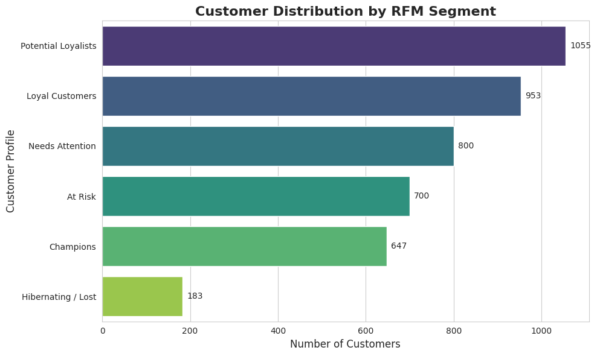

# E-commerce-RFM-Analysis
Transactional data analysis for marketing and customer retention strategies
# Customer Retention and Segmentation Analysis (RFM Model)

## Executive Summary
This project analyzes a transactional dataset from a UK-based online retail e-commerce. The main objective is to translate sales data into actionable marketing strategies, optimizing customer retention and ad budget allocation through RFM (Recency, Frequency, Monetary value) segmentation.

## The Business Problem
Instead of treating all customers equally with expensive, mass-marketing campaigns, this analysis aims to answer four fundamental strategic questions for the Management team:

1. **VIP Identification:** Who are our "Champion" customers (most profitable and loyal), and what percentage of total revenue do they represent?
2. **Churn Prevention:** Which high-value customers are at risk of churning and urgently need a targeted retention campaign?
3. **Growth Potential:** Who are the recent customers with high potential that we should target with cross-selling strategies?
4. **Budget Optimization:** How can we structure personalized offers based on each customer segment to maximize the ROI of our marketing campaigns?

## Methodology and Tools
* **Data:** E-commerce transactional data (Invoices, Dates, Prices, Customer IDs).
* **Methodology:** RFM Analysis to score customers from 1 to 5 across three key dimensions.
* **Tools Used:**
  * **Python:** Core programming language for data processing.
  * **Pandas & NumPy:** Data cleaning, manipulation, and RFM metric calculation.
  * **Matplotlib & Seaborn:** Data visualization and statistical graphics to present business insights.
  * **Jupyter Notebook / Google Colab:** Interactive environment for documenting the analysis process.

## Business Insights & Strategic Recommendations

Based on the RFM segmentation of our customer base, we have identified key actionable insights to optimize the marketing budget and maximize Customer Lifetime Value (CLV):

* **1. The Growth Opportunity (Potential Loyalists - 1,055 customers):** This is our largest segment. They have bought recently but with low frequency. 
**Strategy:** Implement aggressive cross-selling campaigns and welcome email sequences. The goal is to build habit and move them into the "Loyal" tier before their recency drops.

* **2. The Core Revenue Drivers (Champions & Loyal Customers - 1,600 combined):**
These 647 Champions and 953 Loyal Customers are the backbone of the business. 
**Strategy:** Stop offering them profit-eroding discounts; they already love the brand. Instead, focus on retention through exclusivity: early access to new collections, VIP customer service, and referral programs to acquire lookalike audiences.

* **3. The Churn Threat (At Risk & Needs Attention - 1,500 combined):**
We have a significant portion of previously valuable customers who are slipping away. 
**Strategy:** Deploy immediate, highly-targeted win-back campaigns. This is where the aggressive discount budget (e.g., 20% off or free shipping) should be allocated to reactivate them before they fall into the "Hibernating" category.

* **4. Budget Optimization (Hibernating / Lost - 183 customers):**
These customers have the lowest recency, frequency, and monetary scores. 
**Strategy:** Cease paid advertising spend on this group. Shift them to low-cost, automated email workflows or exclude them entirely from custom audience targeting to improve overall campaign ROI.
